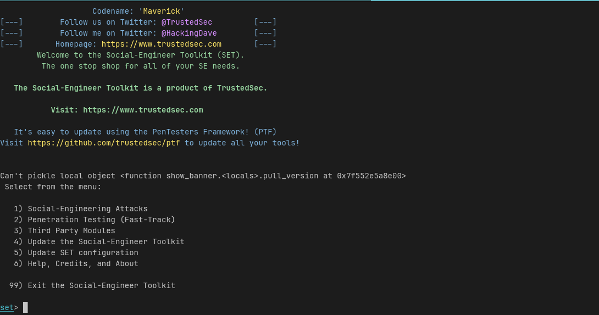
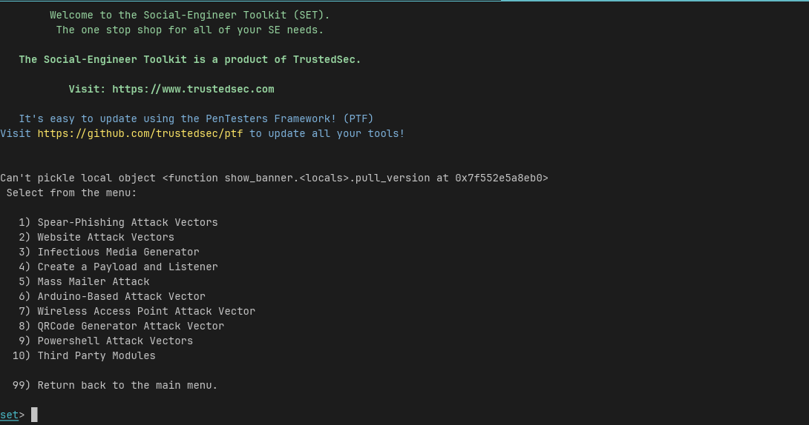
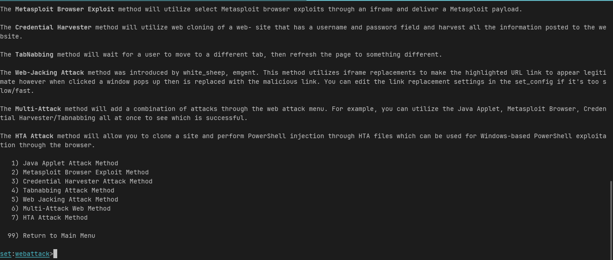
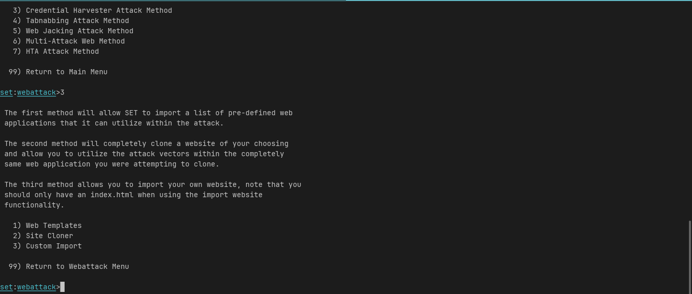
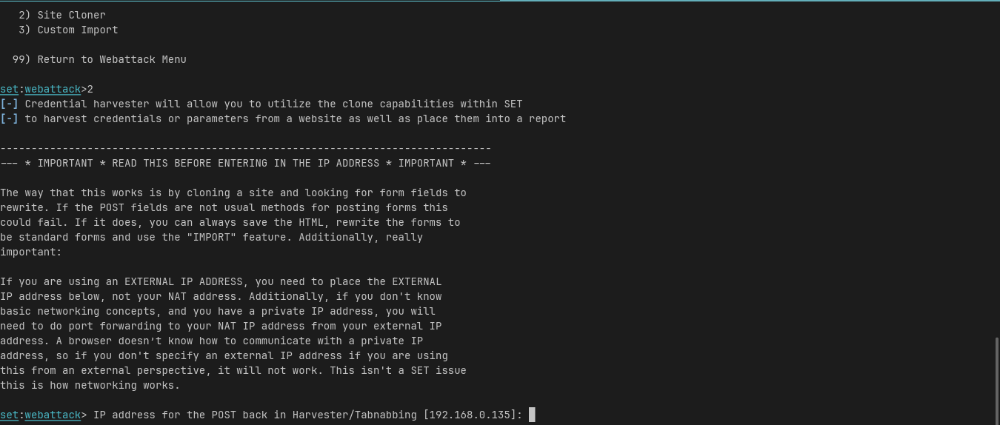
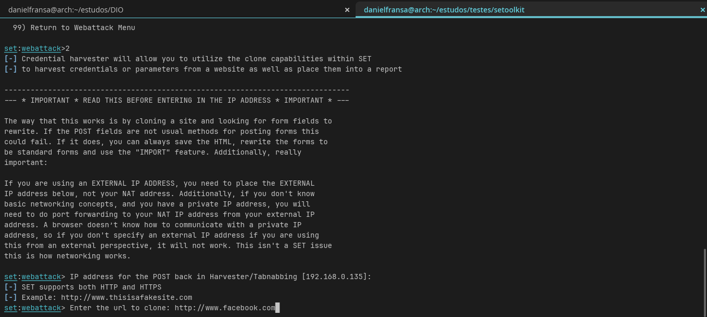
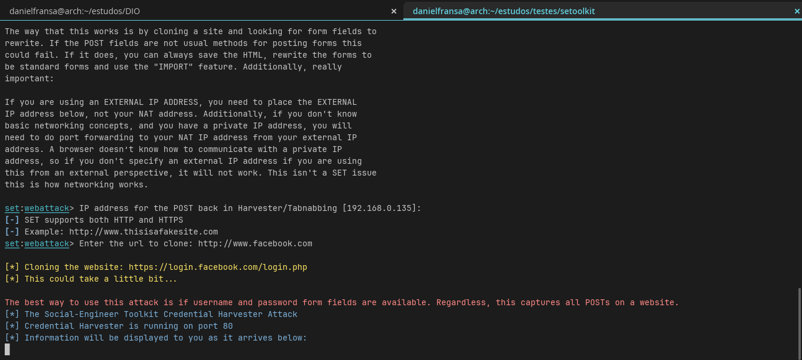
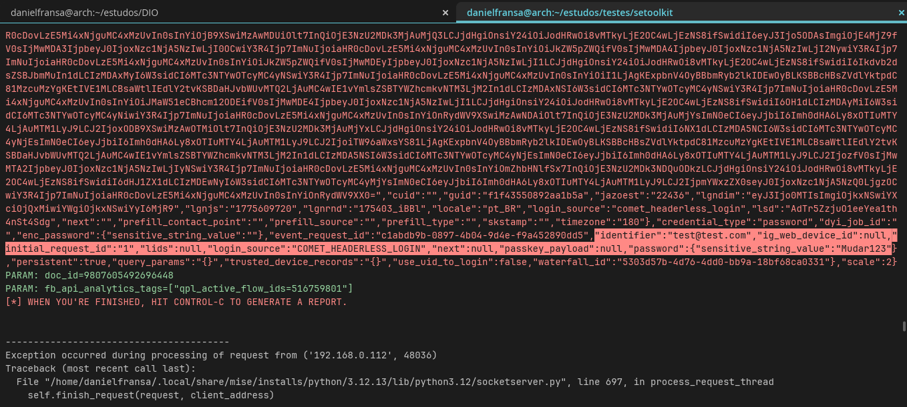

# Phishing para captura de senhas do Facebook

### Ferramentas
 - setoolkit
 - Foi clonado a ferramnta do endereço: [social-engineer-toolkit](https://github.com/trustedsec/social-engineer-toolkit) 

### Configurando o Phishing no Kali Linux
 - Acesso root: Como foi instalado com venv no meu ambiente Arch linux utilizei o comando: sudo 
 - Iniciando o setoolkit: sudo ./.venv/bin/python setoolkit

 - Tipo de ataque: Social-Engineering Attacks
    
 - Vetor de ataque: Web Site Attack Vectors
    
 - Método de ataque: Credential Harvester Attack Method
    
 - Método de ataque: Site Cloner
    
 - Obtendo o endereço da máquina: A propria ferramenta já encontra o IP da máquina e ajusta o mesmo, porem pode utilizar (ip a) no Arch se precisar:
    
 - URL para clone: http://www.facebook.com
    
 - Apos o servidor começa a rodar na porta 80 do nosso endereço IP:
    
 - Vítima acessa a página fake e tem seus daos capturados:
    
    